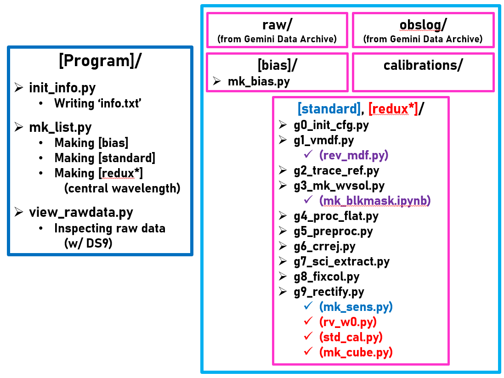

# PyRAF_GMOS_IFU
(updated on 2021. 4. 7.)

## Description
Gemini GMOS/IFU reduction & analysis package imported by PyRAF
* This package is only applicable to an observing program with a single field (not yet to multiple programs/fields... :crying_cat_face: :sweat_drops:).
* In principle, **_one science observation_** per **_one GCAL flat_** is best for this GMOS/IFU reduction workflow. However, there are some exclusive cases (i.e. saturated flats). These codes will be improved to deal with the problems.
* This code is only for GMOS/IFU 2-slit mode. For 1-slit mode, I will update later.
* Reference
  * [GMOS/IFU-1 Data Reduction Tutorial](https://gmos-ifu-1-data-reduction-tutorial-gemini-iraf.readthedocs.io/en/latest/index.html)
  * [GMOS Data Reduction Cookbook](http://ast.noao.edu/sites/default/files/GMOS_Cookbook/index.html)

## Prerequisites
* Gemini GMOS/IFU raw data and the associated calibration data (bias) will be needed.
* The current versions of Python modules in this package are below.
  * ``numpy == 1.18.5``
  * ``pandas == 1.1.3``
  * ``astropy == 4.0.2``
  * ``astroconda`` ([Reference link](https://astroconda.readthedocs.io/en/latest/))
* The following files should be in the working directory.
  * `login.cl` : PyRAF startup file
  * `lacos_spec.cl` : L.A.Cosmic task definition
* Before beginning, you have to check all the observation log files from [Gemini Data Archive](https://archive.gemini.edu/searchform). If there are some problematic data files (due to **_low counts_** or **_saturation_**), you should remove them from `./raw/` directory or move them to other paths.
* [DS9](https://sites.google.com/cfa.harvard.edu/saoimageds9) will be needed for visual inspection of each FITS file.
* For the data from GMOS-N, [mk_extinct.txt](http://ast.noao.edu/sites/default/files/GMOS_Cookbook/_downloads/mk_extinct.txt) ([Buton+13](https://www.aanda.org/articles/aa/pdf/2013/01/aa19834-12.pdf), [Atmospheric extinction properties above Mauna Kea: J/A+A/549/A8](https://cdsarc.unistra.fr/viz-bin/cat/J/A+A/549/A8)) should be downloaded in the reduction directory for atmospheric extinction correction.

## Subdirectories
* `./analysis/` : An analysis directory of the processed GMOS/IFU data
* `./bias/` : A reduction directory for bias data
* `./calibrations/` : A calibration data backup directory (for safety)
* `./obslog/` : Text files of observational log text files retrieved from [Gemini Data Archive](https://archive.gemini.edu/searchform)
* `./raw/` : Raw data from [Gemini Data Archive](https://archive.gemini.edu/searchform) and `obslog.py` from [GMOS Data Reduction Cookbook](http://ast.noao.edu/sites/default/files/GMOS_Cookbook/) with a few bugs revised
  * `./raw/aux/` : Auxillary data with some problems (not included in the reduction process)
* `./redux/` : A reduction directory for object data
* `./standard/` : A reduction directory for standard star data

## Workflow

* A brief summary of the entire workflow of GMOS/IFU data reduction :point_down:



### 1) Initial data check using SQL and DS9
```
cd raw/
python obslog.py obsLog.sqlite3
sqlite3 obsLog.sqlite3

.table
.fullschema

# Check all the observation types
SELECT File,DateObs,Instrument,Object,ObsType,ObsClass,CcdBin,RoI,Disperser,CentWave,T_exp,use_me
FROM obslog GROUP BY ObsType;    # BIAS, ARC, FLAT, OBJECT

# Check all the bias frames
SELECT File,DateObs,Instrument,Object,ObsType,ObsClass,CcdBin,RoI,Disperser,CentWave,T_exp,use_me
FROM obslog WHERE ObsType='BIAS' GROUP BY File;

# Check all the arc frames
SELECT File,DateObs,Instrument,Object,ObsType,ObsClass,CcdBin,RoI,Disperser,CentWave,T_exp,use_me
FROM obslog WHERE ObsType='ARC' GROUP BY File;

# Check the GCAL flat frames (objects)
SELECT File,DateObs,Instrument,Object,ObsType,ObsClass,CcdBin,RoI,Disperser,CentWave,T_exp,use_me
FROM obslog WHERE ObsType='FLAT' GROUP BY File;

# Check all the object frames
SELECT File,DateObs,Instrument,Object,ObsType,ObsClass,CcdBin,RoI,Disperser,CentWave,T_exp,use_me
FROM obslog WHERE ObsType='OBJECT' AND ObsClass='science' GROUP BY File;

# Check the standard star frames
SELECT File,DateObs,Instrument,Object,ObsType,ObsClass,CcdBin,RoI,Disperser,CentWave,T_exp,use_me
FROM obslog WHERE ObsType='OBJECT' AND ObsClass='partnerCal' GROUP BY File;

# Check the GCAL flat frames (standards)
SELECT File,DateObs,Instrument,Object,ObsType,ObsClass,CcdBin,RoI,Disperser,CentWave,T_exp,use_me
FROM obslog WHERE ObsType='FLAT' GROUP BY File;

# Check the twilight flat frames
SELECT File,DateObs,Instrument,Object,ObsType,ObsClass,CcdBin,RoI,Disperser,CentWave,T_exp,use_me
FROM obslog WHERE ObsType='OBJECT' AND ObsClass='dayCal' GROUP BY File;
```

After checking these, run ``view_rawdata.py`` with revising the file names for visual inspection. If there are any problems in some raw data files, please move them in a seperate directory (`./raw/aux/`) in order not to include them in the reduction process.

### 2) Writing raw data file list
```
$ ipython
> run init_info.py
> (run view_rawdata.py)
> run mk_list.py
```

``init_info.py`` writes a text file with all the information of raw data, and ``mk_list.py`` makes the basic structures of directories for the reduction process.

### 3) Setting ``astroconda`` environment for running PyRAF
```
$ conda activate iraf27
$ ipython
(Python 2.7)
```

After activating the ``astroconda`` environment (Python 2), you can process raw data with the order of `bias` - `standard` - `redux`.
